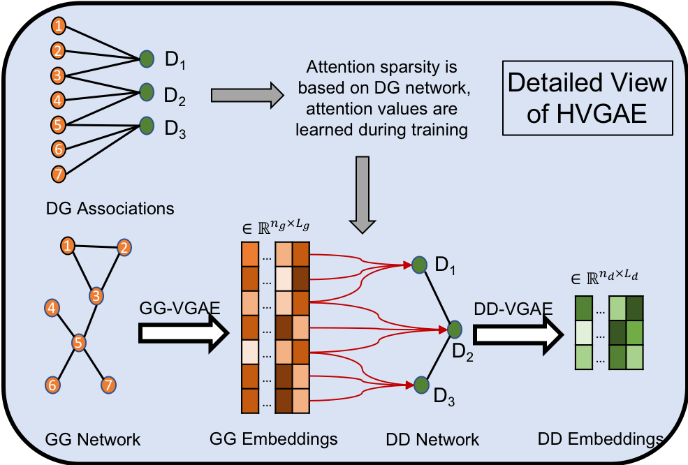

HVGAE in TensorFlow
===

TensorFlow implementation of Hierarchical Variational Graph Auto-Encoder (HVGAE) with attentional pooling for gene-gene and disease-disease networks embedding. 




## Requirements
The code has been tested on a Python 2.7.16 conda environment with CUDA 9.0.176, cuDNN 7.0.5, and following packages:

* numpy == 1.16.2
* scipy == 1.2.1
* networkx == 2.2
* scikit-learn == 0.20.3
* tensorflow-gpu == 1.11.0

To run the code, download the following datasets and put it in the ```./data``` folder:

* disease_adj.npy
* genes_genes_net.npy
* gene_GO1_net.npy
* gene_GO2_net.npy
* gene_GO3_net.npy
* gene_pathway.npy
* disease_gene_net.npy

## Usage
The following hyperparameters can be modified using args input. The default values reproduce the reported numbers in the paper.

* --epochs = number of epochs to train
* --lr = learning rate
* --hd = number of hidden units for DD-VGAE
* --zd = number of latent dimensions for DD-VGAE
* --hg = number of hidden units for GG-VGAE
* --zg = number of latent dimensions for GG-VGAE
* --nfeats = dimension of GG features after transform
* --dropout = dropout rate (1 - keep probability)

### Run the code
 * Example 1: ```python train.py```
 * Example 2: ```python train.py --lr 0.01```
