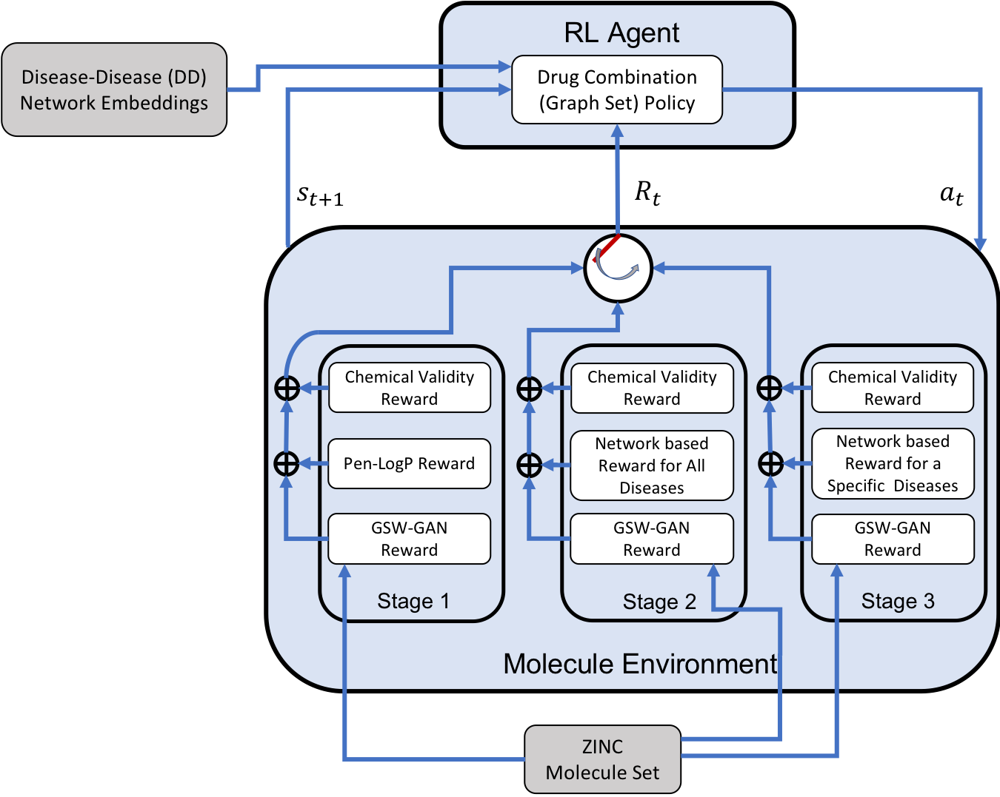

Graph set generation in Tensorflow
===

TensorFlow implementation of drug combination generation as graph sets.



## Installation
- Install rdkit, please refer to the offical website for further details, using anaconda is recommended:
```bash
conda create -c rdkit -n my-rdkit-env rdkit
```
- Install mpi4py, networkx:
```bash
conda install mpi4py
pip install networkx=1.11
```
- Install OpenAI baseline dependencies:
```bash
cd rl-baselines
pip install -e .
```
- Install customized molecule gym environment:
```bash
cd gym-molecule
pip install -e.
```


## Code description
There are 4 important files:
- `run_drug_comb_generator.py` is the main code for running the program. 
- The molecule environment code is in `gym-molecule/gym_molecule/envs/molecule.py`.
- RL related code is in `rl-baselines/baselines/ppo1` folder: `gcn_policy.py` is the GCN policy network; `pposgd_simple_gcn.py` is the PPO algorithm specifically tuned for GCN policy.

## Drug scaffolds
2 drug scaffolds (in case of pairwise drug combination) with SDF representation should be provided as `d1_sdf.txt` and `d2_sdf.txt` to run the code.

## Disease ID
Drug combinations can be generated for 299 disease. To run the code for an specific disease you should check its ID from `Disease_ID.txt` file and use `--disease_id=42` (for example breast cancer) as the argument.

## Hyperparameters
There are plenty of hyperparameters in the model. The important ones to consider are:
* --lr: Initial learning rate
* --load\_step: Iteration number to initialized the weights (the default value is 6300 and is provided in the `ckpt` folder)
* --disease\_id: Disease Id to generate drug combination for
* --network\_weight: Hyperparameter to balance the weight of the network score
* --deepaffinity\_thr: Threshold of affinity above which we consider there is interaction between compound and protein.

## Run
- single process run
```bash
python run_drug_comb_generator.py --disease_id=42
```
- mutiple processes run
```bash
mpirun -np 8 python run_drug_comb_generator.py --disease_id=42 2>/dev/null
```
`2>/dev/null` will hide the warning info provided by rdkit package.
- GPU run
```bash
python run_drug_comb_generator.py --disease_id=42

```

All the generated molecules along the training process will be stored in the `molecule_gen` folder, each run configuration is stored in a different csv file. Molecules are stored using SMILES strings, along with the desired properties scores.


## Network score calculation
At first, you need to provide two input files "drug_eval1.txt" and "drug_eval2.txt" (in SMILE format). You can calculate network score for these drug pairs by running:
```bash
python run_deepaffinity.py --disease_id=42
```

The output files would "reward_eval.txt" and "adverse_eval.txt" corresponding to network score and adverse score (intersection of drug targets) respectively.
## Note
Our code is based on open source implementation of graph convolutional policy networks by [You et. al., 2018](https://github.com/bowenliu16/rl_graph_generation).
