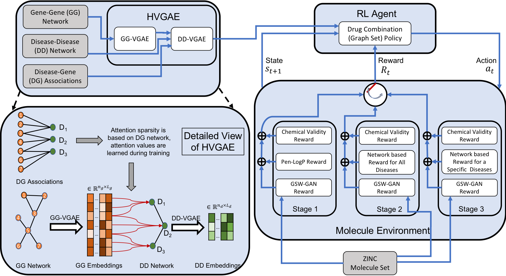

# Drug-Combo-Generator
Deep Generative Models for Drug Combination (Graph Set) Generation given Hierarchical Disease Network Embedding

## Abstract
Combination therapy has shown to improve therapeutic efficacy while reducing side effects.  Importantly, it has become an indispensable strategy to overcome resistance in antibiotics, anti-microbials, and anti-cancer drugs.  Facing enormous chemical space and unclear design principles for small-molecule combinations, computational drug-combination design has not seen generative models to meet its potential to accelerate resistance-overcoming drug combination discovery. We have developed the first deep generative model for drug combination design, by jointly embedding graph-structured domain knowledge and iteratively training a reinforcement learning-based chemical graph-set designer.  First, we have developed Hierarchical Variational Graph Auto-Encoders (HVGAE) trained end-to-end to jointly embed gene-gene, gene-disease, and disease-disease networks.  Novel attentional pooling is introduced here for learning disease-representations from associated genes' representations.  Second, targeting diseases in learned representations, we have recast the drug-combination design problem as graph-set generation and developed a deep learning-based model with novel rewards.  Specifically, besides chemical validity rewards, we have introduced novel generative adversarial award, being generalized sliced Wasserstein, for chemically diverse molecules with distributions similar to known drugs.  We have also designed a network principle-based reward for drug combinations.  Numerical results indicate that, compared to state-of-the-art graph embedding methods, HVGAE learns more informative and generalizable disease representations. Results also show that the deep generative models generate drug combinations following the principle across diseases.  Case studies on four diseases show that network-principled drug combinations tend to have low toxicity.  The generated drug combinations collectively cover the disease module similar to FDA-approved drug combinations and could potentially suggest novel systems-pharmacology strategies.  Our method allows for examining and following network-based principle or hypothesis to efficiently generate disease-specific drug combinations in a vast chemical combinatorial space. 

## Table of contents
* Data: Contains curated biological networks such as gene-gene network, disease-gene association and etc. 
* Methods: 
	* HVGAE: Hierarchical Variational Graph Auto-Encoder (HVGAE) with attentional pooling for gene-gene and disease-disease networks embedding
	* RL: Drug combination generation as graph sets
* Results: Contains top drug combination generated in our paper for melanoma, breast cancer, lung cancer and ovarian cancer 

## Testing
To test our model, please follow the steps below:
* Go to the Data directory and follow the instructions.
* To run the HVGAE part, go to the Methods/HVGAE directory and follow the instructions.
* To run the drug generation part, go to the Methods/RL directory and follow the instructions.

## Contacts
Yang Shen: yshen@tamu.edu
Mostafa Karimi: mostafa_karimi@tamu.edu
Arman Hasanzadeh: armanihm@tamu.edu
